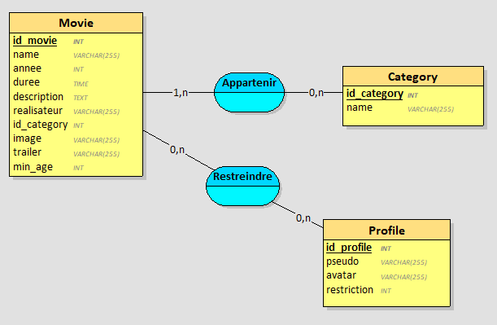

# Partie Base de Données

## Itérations 1

### Requêtes
Pour récupérer les identifiants, noms et images des films :

```
"select Movie.id_movie, Movie.name, Movie.image from Movie";
```

J'ai modifié les appellations des id de Movie et de Category pour éviter les confusions plus-tard :

```
CREATE TABLE `Movie` (
  `id_movie` int(11) NOT NULL AUTO_INCREMENT PRIMARY KEY,
  ...
) ENGINE=InnoDB DEFAULT CHARSET=utf8;
```

```
CREATE TABLE `Category` (
    `id_category` int(11) NOT NULL AUTO_INCREMENT PRIMARY KEY
    `name` varchar(255) NOT NULL
) ENGINE=InnoDB DEFAULT CHARSET=utf8;
```

### Vue Looping


## Itérations 2

### Requêtes
Pour insérer les informations d'un film :

```
"insert into Movie (`name`, `year`, `length`, `description`, `director`, `id_category`, `image`, `trailer`, `min_age`) 
values (:titre, :annee, :duree, :desc, :real, :categorie, :img, :lien, :age)"
```

Pour récupérer les catégories disponibles dans la base de donnée afin de les implémenter dynamiquement dans un menu de sélection pour empêcher les erreurs, incohérences ou fautes d'orthographe :

```
"select id_category, name from Category"
```

## Itérations 3

### Requêtes

Pour récupérer toutes les informations d'un film sélectionné :

```
"select Movie.*, Category.name as category_name from Movie 
join Category on Movie.id_category = Category.id_category 
where Movie.id_movie=:id"
```

## Itérations 4

### Requêtes

Pour récupérer les identifiants, noms et images des films ainsi que les identifiants des catégories existantes dans la base de donnée triés par ordre alphabétique des catégories et des films :

```
"select Movie.id_movie, Movie.name, Movie.image, Category.name as category_name from Movie 
join Category on Movie.id_category = Category.id_category 
order by Category.name, Movie.name"
```

## Itérations 5

### Requêtes

Pour insérer les informations d'un profil utilisateur :

```
"insert into Profile (`pseudo`, `avatar`, `min_age`) 
values (:pseudo, :avatar, :age)"
```

J'ai dû créer une nouvelle table pour pouvoir ajouter des profils : 

```
CREATE TABLE `Profile` (
    `id_profile` int(11) NOT NULL AUTO_INCREMENT PRIMARY KEY,
    `pseudo` varchar(255) NOT NULL,
    `avatar` varchar(255) DEFAULT NULL,
    `min_age` int(11) DEFAULT 0
) ENGINE=InnoDB DEFAULT CHARSET=utf8;
```

J'ai aussi dû modifier le min_age de Movie en 0 par défaut au lieu de NULL pour éviter des erreurs à cause du NULL dans les values des options "Tout public" des formulaires, où dans les scripts.js où j'ai une condition pour afficher la restriction d'âge :

```
CREATE TABLE `Movie` (
  ...
  `min_age` int(11) DEFAULT 0
) ENGINE=InnoDB DEFAULT CHARSET=utf8;
```

### Vue Looping


## Itérations 6

### Requêtes

Pour récupérer les données d'un profil utilisateur :

```
"select * from Profile"
```

## Itération 7

### Requêtes

Pour récupérer 

```
"select * from Profile where id_profile=:id"
```

### Vue Looping



## Itération 8

### Requêtes


```

```

## Itération 9

### Requêtes


```

```

### Vue Looping


## Itération 10

### Requêtes


```

```

## Cardinalités

- Pour Movie vers Category : 1:N car un film peut appartenir au minimum à une catégorie, ou à plusieurs
- Pour Category vers Movie : 0:N car une catégorie peut n'appartenir à aucun film car elle existe dans la base mais n'est pas attribuée, ou à autant de films qu'on veut

- Pour Movie vers Profile : 0:N car un film peut n'être restreint par aucun profil comme les "Tout public", ou peut être restreint par plusieurs profils comme "Déconseillé au -18ans"
- Pour Profile vers Movie : 0:N car un profil peut ne restreindre aucun films comme "Tout public", ou peut restreindre plusieurs films selon l'âge