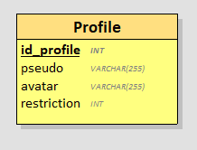
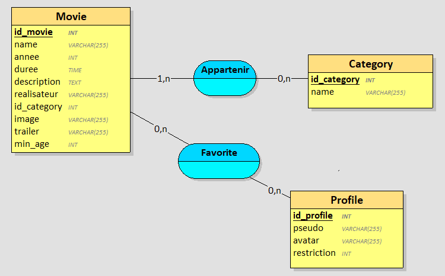

# Partie Base de Données

## Itérations 1

### Requêtes
Pour récupérer les identifiants, noms et images des films :

```
"select Movie.id_movie, Movie.name, Movie.image from Movie";
```

J'ai modifié les appellations des id de Movie et de Category pour éviter les confusions plus-tard :

```
CREATE TABLE `Movie` (
  `id_movie` int(11) NOT NULL AUTO_INCREMENT PRIMARY KEY,
  ...
) ENGINE=InnoDB DEFAULT CHARSET=utf8;
```

```
CREATE TABLE `Category` (
    `id_category` int(11) NOT NULL AUTO_INCREMENT PRIMARY KEY
    `name` varchar(255) NOT NULL
) ENGINE=InnoDB DEFAULT CHARSET=utf8;
```

### Vue Looping


## Itérations 2

### Requêtes
Pour insérer les informations d'un film :

```
"insert into Movie (`name`, `year`, `length`, `description`, `director`, `id_category`, `image`, `trailer`, `min_age`) 
values (:titre, :annee, :duree, :desc, :real, :categorie, :img, :lien, :age)"
```

Pour récupérer les catégories disponibles dans la base de donnée afin de les implémenter dynamiquement dans un menu de sélection pour empêcher les erreurs, incohérences ou fautes d'orthographe :

```
"select id_category, name from Category"
```

## Itérations 3

### Requêtes

Pour récupérer toutes les informations d'un film sélectionné :

```
"select Movie.*, Category.name as category_name from Movie 
join Category on Movie.id_category = Category.id_category 
where Movie.id_movie=:id"
```

## Itérations 4

### Requêtes

Pour récupérer les identifiants, noms et images des films ainsi que les identifiants des catégories existantes dans la base de donnée triés par ordre alphabétique des catégories et des films :

```
"select Movie.id_movie, Movie.name, Movie.image, Category.name as category_name from Movie 
join Category on Movie.id_category = Category.id_category 
order by Category.name, Movie.name"
```

## Itérations 5

### Requêtes

Pour insérer les informations d'un profil utilisateur :

```
"insert into Profile (`pseudo`, `avatar`, `min_age`) 
values (:pseudo, :avatar, :age)"
```

J'ai dû créer une nouvelle table pour pouvoir ajouter des profils : 

```
CREATE TABLE `Profile` (
    `id_profile` int(11) NOT NULL AUTO_INCREMENT PRIMARY KEY,
    `pseudo` varchar(255) NOT NULL,
    `avatar` varchar(255) DEFAULT NULL,
    `min_age` int(11) DEFAULT 0
) ENGINE=InnoDB DEFAULT CHARSET=utf8;
```

J'ai aussi dû modifier le min_age de Movie en 0 par défaut au lieu de NULL pour éviter des erreurs à cause du NULL dans les values des options "Tout public" des formulaires, où dans les scripts.js où j'ai une condition pour afficher la restriction d'âge :

```
CREATE TABLE `Movie` (
  ...
  `min_age` int(11) DEFAULT 0
) ENGINE=InnoDB DEFAULT CHARSET=utf8;
```

### Vue Looping



## Itérations 6

### Requêtes

Pour récupérer les données d'un profil utilisateur :

```
"select * from Profile"
```

## Itération 7

### Requêtes

Pour récupérer les films en fonction de l'âge du profil sélectionné :

```
"select Movie.id_movie, Movie.name, Movie.image, Category.name as category_name from Movie 
join Category on Movie.id_category = Category.id_category 
where Movie.min_age <= :age 
order by Category.name, Movie.name"
```

## Itération 8

### Requêtes

Pour modifier un profil sélectionné :

```
"update Profile set pseudo=:pseudo, avatar=:avatar, min_age=:age where id_profile=:id"
```

## Itération 9

### Requêtes

J'ai créé une nouvelle table pour gérer les favoris d'un profil :

```
CREATE TABLE `Favorite` (
  `id_favorite` int(11) NOT NULL AUTO_INCREMENT PRIMARY KEY,
  `id_profile` int(11) NOT NULL,
  `id_movie` int(11) NOT NULL,
  `date_added` datetime DEFAULT CURRENT_TIMESTAMP,
  FOREIGN KEY (`id_profile`) REFERENCES `Profile`(`id_profile`),
  FOREIGN KEY (`id_movie`) REFERENCES `Movie`(`id_movie`),
) ENGINE=InnoDB DEFAULT CHARSET=utf8;
```

Pour ajouter aux favoris :

```
"insert into Favorite (`id_profile`, `id_movie`) 
values (:id_profile, :id_movie)"
```

Pour lire les favoris d'un profil :

```
"select Movie.* from Movie 
join Favorite on Movie.id_movie = Favorite.id_movie 
where Favorite.id_profile = :id_profile
order by Favorite.date_added DESC"
```

Pour récupérer la liste des films dans les favoris :

```
"select *from Favorite where id_profile = :id_profile and id_movie = :id_movie"
```

### Vue Looping



## Itération 10

### Requêtes

Pour supprimer un film des favoris

```
"delete from Favorite where id_profile = :id_profile and id_movie = :id_movie"
```

## Itération 11

### Requêtes

J'ai ajouté un élément booléen dans la table Movie pour gérer le statut mis en avant :

```
`featured` tinyint(1) DEFAULT 0
```

Pour récupérer le statut d'un film :

```
"select id_movie, name, image, description from Movie 
where featured = 1"
```

## Itération 12

### Requêtes

#### 1 - Stats utilisateur & engagement

Pour récupérer le nombre total de profil créés :

```
"select count(*) from Profile"
```

Pour récupérer le nombre moyen de films par profil dans les favoris :

```
"select round(avg(total)) from (
  select count(*) as total from Favorite group by id_profile
) as counts"
```

#### 2 - Stats films & catalogue 
Pour récupérer le nombre total de films dans la base :

```
"select count(*) from Movie"
```

Pour récupérer le film le plus ajouté aux favoris :

```
select Movie.name from Movie
join (
    select id_movie, count(*) as total from Favorite 
    group by id_movie
    order by total desc
    limit 1
) as top on Movie.id_movie = top.id_movie;
```

Pour récupérer la catégorie la plus populaire :

```
select Category.name from Category
join (
    select Movie.id_category, count(*) as total from Favorite 
    join Movie on Favorite.id_movie = Movie.id_movie
    group by Movie.id_category
    order by total desc
    limit 1
) as top on Category.id_category = top.id_category;
```

## Itération 13

### Requêtes

Pour récupérer le titre et l'image des films tapés dans la barre de recherche :

```
"select id_movie, name, affcihe from Movie where name like :search"
```

## Itération 14

### Requêtes

Pour récupérer le titre, l'affcihe et le statut des films tapés dans la barre de recherche :

```
"select id_movie, name, image, featured from Movie where name like :search"
```

Pour mettre à jour le statut des films :

```
"update Movie set featured=:statut where id_movie=:id"
```

## Itération 15

### Requêtes


```

```


```

```
## Itération 16

### Requêtes


```

```

## Itération 17

### Requêtes


```

```

## Itération 18

### Requêtes


```

```

## Itération 19

### Requêtes


```

```

## Cardinalités

- Pour Movie vers Category : 1:N car un film peut appartenir au minimum à une catégorie, et au maximum à plusieurs
- Pour Category vers Movie : 0:N car une catégorie peut au minimum n'appartenir à aucun film car elle existe dans la base mais n'est pas attribuée, et au maximum à autant de films qu'on veut

- Pour Movie vers Profile : 0:N car un film peut au minimum n'être restreint par aucun profil comme les "Tout public", et peut au maximum être restreint par plusieurs profils comme "Déconseillé au -18ans"
- Pour Profile vers Movie : 0:N car un profil peut au minimum ne restreindre aucun films comme "Tout public", et peut au maximum restreindre plusieurs films selon l'âge

- Pour Movie vers Favorite : 0:1 car un film peut, au minimum, ne pas apparaître dans une liste, et au maximum, apparaître qu'une seule fois dans une liste de favoris
- Pour Favorite vers Movie : 0:N car une liste de favoris peut faire apparaître au minimum aucun film, et au maximum tous les films proposés

- Pour Profile vers Favorite : 1:1 car un profil possède au minimum et au maximum une seule liste de favoris, qu'elle soit vide ou non
- Pour Favorite vers Profile : 1:N car une liste est possédée par au minimum un profil et au maximum par tous les profils