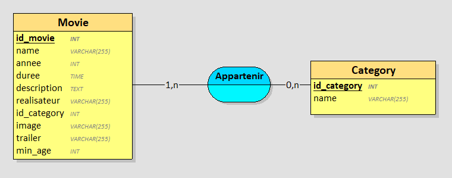

# Partie Base de Données

## Itérations 1

### Requêtes
Pour récupérer les identifiants, noms et images des films :
"select Movie.id_movie, Movie.name, Movie.image from Movie";

J'ai modifié l'appelation de l'id pour mieux l'identifier

### Vue Looping

### Cardinalités

1:N car un film appartient au minimum à une catégorie, et à plusieurs
0:N car une catégorie peut n'appartenir à aucun film, et à autant qu'on veut

## Itérations 2

### Requêtes

### Vue Looping

### Cardinalités

## Itérations 3

### Requêtes

### Vue Looping

### Cardinalités

## Itérations 4

### Requêtes

### Vue Looping

### Cardinalités

## Itérations 5

### Requêtes

### Vue Looping

### Cardinalités

## Itérations 6

### Requêtes

### Vue Looping

### Cardinalités

